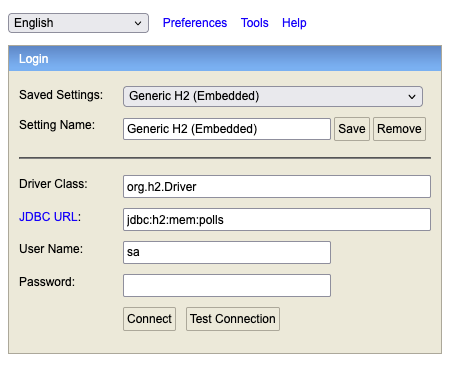
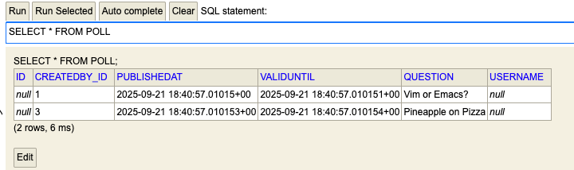
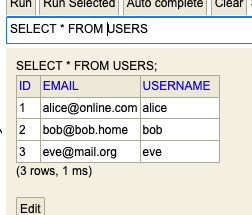
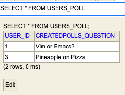
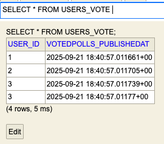
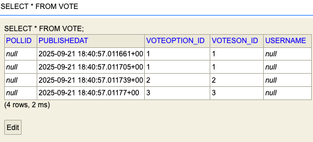
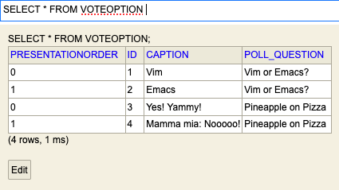

# DAT250: Software Technology Experiment Assignment 4
## Introduction
In this assignment I integrated JPA data into the project.

## Technical problems
I found that my biggest problems were the technical debt accumulated over the previous assignments, from assumption of the class diagram to methods that I designed, and that were absent from the provided tests. I had to modify some of the test to fit my class structure.

I also had to align my assumptions with the ones declared in the test file, some helper methods I had to add as I did not anticipate the relationships between Users, Polls, VoteOptions, and Votes in that exact way.

Adding the annotations to my existing classes was simple, however I got repeatedly stuck on setting relationships between my classes (OneToMany, ManyToMany, OneToOne) for those who were not base classes. The error logs were not super clear to me.

Finally I also got stuck on the problem that User is not a valid table name by default, so I also had to rename it to users.

## Inspection of database
I inspected my database by adding a h2 webserver when the test is running, and pausing the tests via 'thread.sleep()' when I'd like to inspect the table. Then in a web browser I can explore the table structure like in the following screenshots.

